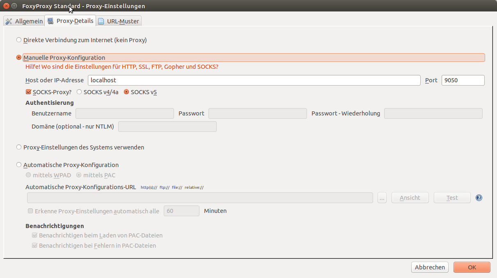
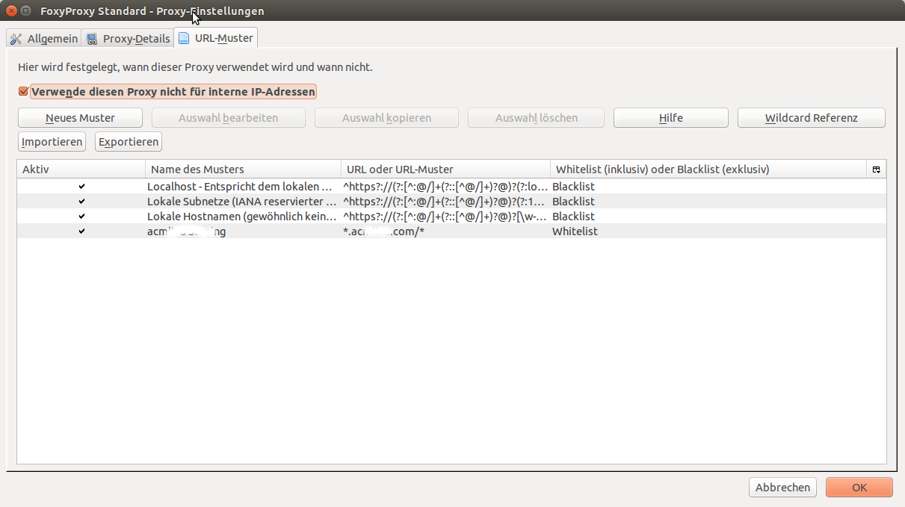

## Problem
You want to access a firewalled server from your local machine which has a dynamic IP assigned by your internet provider that changes regularly. The server you want to access has a firewall that whitelists the IP addresses that are allowed to access.

## Solution
The solution I found working for me is to tunnel all traffic to these restricted servers through a machine that has a fixed IP address, in my case a web server I use for lots of other purposes.
You should be able to ssh into that server and add ssh keys. If the firewalled machine does not have a dns’ed IP address you may need to edit your remote server’s `/etc/hosts` file to add these servers there.

## Browser Access
In order to access a firewalled server with a browser, I’m using a SOCKS proxy that tunnels traffic through my remote server:

```
ssh -CN -D 9050 user@my-remote-server
```

This creates a SOCKS proxy that you can access at [localhost:9050](localhost:9050).
I found it easiest to use with Firefox and the FoxyProxy plugin. You can give that plugin a url mask- if that matches it will use the SOCKS proxy, otherwise it will use the default connection.

Here are my settings for the SOCKS proxy within FoxyProxy:






__Update 7.5.2016:__ As [Richard](https://x.com/d6y) reports, if you are on a Mac you can configure its on board socks proxy like so:

```
# enable it:
sudo networksetup -setsocksfirewallproxy Wi-Fi localhost 9050
```

```
# disable it:
sudo networksetup -setsocksfirewallproxystate Wi-Fi off
```

The `networksetup` command also has an option `-setproxybypassdomains` to exclude certain domains from using the configured proxy.


## SSH Access
Establishing ssh access is a tad bit more involved, but not too much. It also uses a ssh tunnel through the fixed IP remote server.
I set up a ssh config that allows me to type `ssh firewalled-server` and get a connection from my dynamic IP, without having to login to the remote machine and open another ssh session from there.


In your `~/.ssh` directory create a `config` file that will contain entries like the following, separated by a blank line:

```
Host firewalled-server
Hostname firewalled-server
User my-username
ForwardAgent yes
Port 22
ProxyCommand ssh my-username@my-remote-server /bin/nc %h %p
```

On your remote server you should setup key based access by adding a ssh key to the authorized_keys file.

If the name of your firewalled server is not known through public dns you need to add the name(s) of your firewalled servers to the `/etc/hosts` file.

Then, from your remote server, you should ensure you can ssh into the firewalled server, have added ssh key based access and accepted the fingerprint of the firewalled server so it’s added to the `known_hosts` file.

If it works to log in from your local machine to your remote server and from there login via ssh key to the firewalled server, you should be able to directly hit the firewalled server via:

```
ssh firewalled-server
```

Unless, of course, we forgot something…
